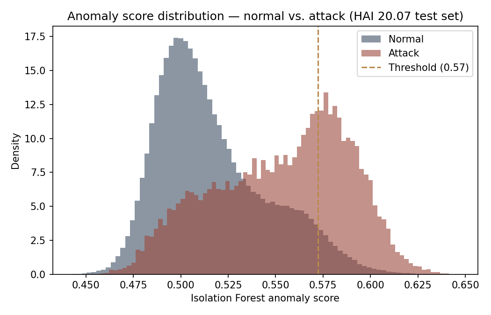
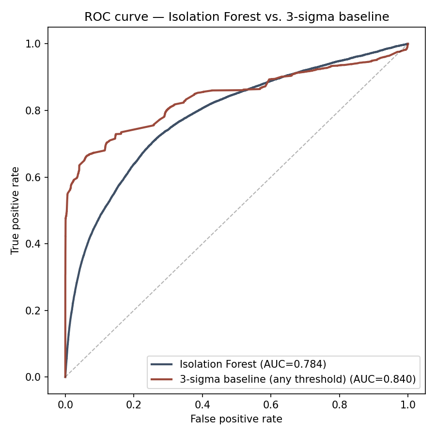
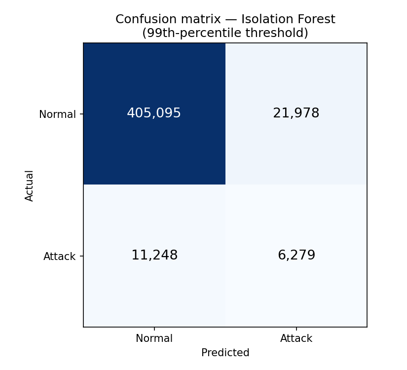
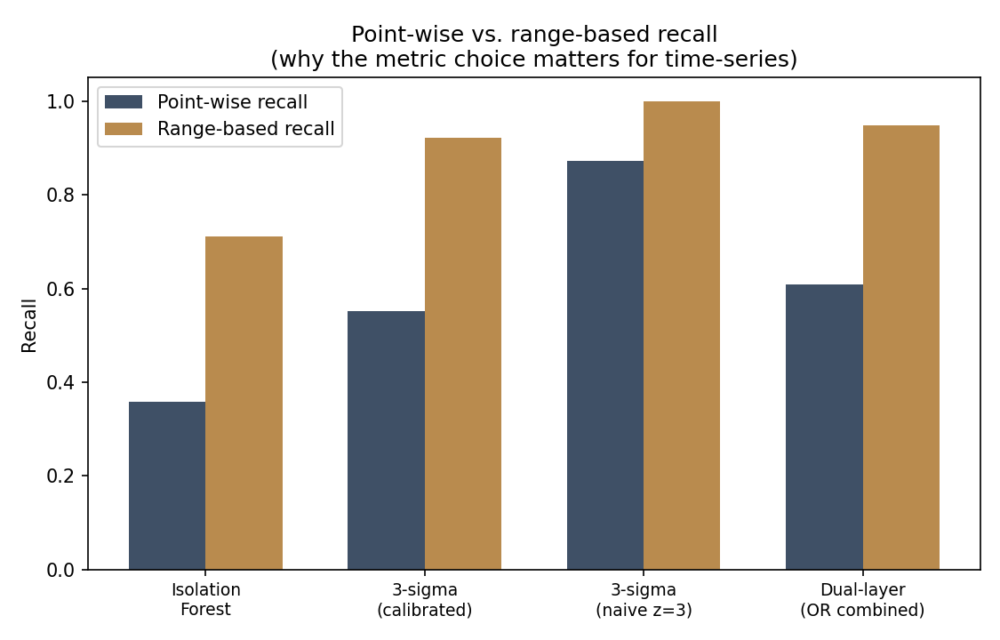

# Anomaly Detection Evaluation — HAI 20.07 ICS Security Dataset

## Why this evaluation exists

The IronLedger dashboard demo (in `/frontend` and `/backend`) uses synthetic
telemetry: I generate normal-looking sensor noise, then script a specific
attack scenario, and both the physics thresholds and the Isolation Forest
score against data I also generated. That's fine for demonstrating the
*framework's* mechanics — the ledger, the hash-chain tamper detection, the
forensic reconstruction — but it proves nothing about whether the
**detection approach itself** (physics envelope + Isolation Forest) actually
works. A model can't fail a test it was allowed to write.

This evaluation instead runs the same detection approach against the
**HAI 20.07 dataset** — a real, published, peer-reviewed ICS security
dataset collected from an actual hardware-in-the-loop testbed (a combined
boiler, turbine, and water-treatment process), with real injected attacks
and ground-truth labels supplied by the dataset's authors, not by me.

**Dataset:** Shin, Lee, Yun & Kim, *"HAI 1.0: HIL-Based Augmented ICS
Security Dataset,"* 13th USENIX Workshop on Cyber Security Experimentation
and Test (CSET 2020). Published at
[github.com/icsdataset/hai](https://github.com/icsdataset/hai), CC BY-SA 4.0.

## Method

**Data.** `train1.csv` + `train2.csv` (550,800 rows, 59 sensor/actuator
tags) as the normal-operation baseline, and `test1.csv` + `test2.csv`
(444,600 rows) as the labeled evaluation set. One data-quality note worth
flagging rather than hiding: 776 rows in `train2` are actually labeled
`attack==1` despite being in the "normal" training files — these were
excluded from model fitting rather than silently included.

**Split, to avoid threshold leakage.** The normal data was split 80/20. The
Isolation Forest was fit only on the 80% (subsampled to 100,000 rows for
tractable training time — this doesn't materially change the fit; Isolation
Forest characterizes the bulk distribution, not the tails, so more rows
mostly add redundant normal examples). The held-out 20% was used *only* to
pick a detection threshold (the 99th percentile of its anomaly scores),
never seen during fitting. The labeled test set was touched only for final
evaluation.

**Models compared:**
1. **Isolation Forest** — this project's actual approach (`backend/app/anomaly.py`), 150 estimators, features standardized before fitting.
2. **3-sigma baseline, calibrated** — flag a point anomalous if any single feature's z-score (relative to training mean/std) exceeds a threshold calibrated the same way as the Isolation Forest (99th percentile of held-out normal scores). This is the same "hard threshold" idea as this project's physics-envelope layer, generalized across all 59 features instead of 3 hand-picked ones.
3. **3-sigma baseline, naive fixed z=3** — the same rule but with a textbook fixed cutoff instead of a calibrated one. Included deliberately to show a pitfall: with 59 roughly-independent features, the chance that *at least one* exceeds any fixed per-feature cutoff by chance alone is far higher than the nominal single-feature false-positive rate. A fixed threshold that looks reasonable per-feature becomes far too trigger-happy once you're checking 59 of them at once.
4. **Dual-layer (OR combined)** — flag anomalous if *either* the Isolation Forest or the calibrated 3-sigma rule fires. This mirrors the actual design philosophy used elsewhere in this project (physics threshold OR ML score), so it seemed worth testing rather than just asserting.

**Metrics.** Point-wise precision/recall/F1/ROC-AUC, plus a **range-based
recall**: did the detector flag at least one point inside each contiguous
attack segment? The dataset's own authors published a follow-up paper
specifically arguing that point-wise metrics distort time-series anomaly
detection results — Hwang, Yun, Kim & Min, *"Do You Know Existing Accuracy
Metrics Overrate Time-Series Anomaly Detections?"* (ACM SAC 2022) — and
recommend their own **eTaPR** metric. I did not implement full eTaPR here
(it's a nontrivial published algorithm in its own right, out of scope for
this evaluation), but range-based recall is a simple, honest approximation
of what it corrects for, and the gap between point-wise and range-based
numbers below shows why the distinction matters.

## Results

444,600 test rows, 38 distinct attack segments, 3.94% of rows labeled attack.

| Detector | Precision | Recall (point) | F1 | ROC-AUC | Recall (range, /38 segments) |
|---|---|---|---|---|---|
| Isolation Forest | 0.222 | 0.358 | 0.274 | 0.784 | 0.711 (27/38) |
| 3-sigma, calibrated | **0.770** | 0.551 | **0.642** | **0.840** | 0.921 (35/38) |
| 3-sigma, naive z=3 | 0.058 | 0.871 | 0.109 | 0.840 | 1.000 (38/38) |
| Dual-layer (OR) | 0.305 | **0.609** | 0.406 | 0.785 | 0.947 (36/38) |






## Discussion — an honest result, not a clean win

The result here is **not** "our fancy ML model beats the naive baseline,"
and I'd rather report that plainly than dress it up. On this dataset, at a
comparably-calibrated operating point, the **calibrated 3-sigma rule beats
the Isolation Forest on every metric** — nearly 3.5x the precision, better
recall, better F1, better ROC-AUC, and catches more attack segments.

A plausible reason: Isolation Forest's anomaly score comes from average
random-partition path length across an ensemble of trees built on random
feature subsamples. If an attack in this dataset typically manifests as one
sensor being pinned, frozen, or spiked to an extreme value (common in ICS
attacks — a spoofed or forced measurement), a rule that directly asks "is
any single feature extreme?" is a very direct match for that failure mode.
Isolation Forest, by contrast, is built to find points that are
multivariately unusual in combination, which can under-weight a single
extreme dimension when it's diluted across many trees that didn't happen to
split on that exact feature. This is a plausible explanation, not a proven
one — confirming it would need per-attack inspection of which features
actually moved during each of the 38 segments, which is a natural next step
but wasn't done here.

The naive fixed-threshold row is the clearest illustration of the
multiple-comparisons pitfall: it "wins" on raw recall (0.871) and range
recall (100%) but does so by flagging 247,679 normal rows as attacks — a
58% false-positive rate that would make it operationally useless despite
its impressive-looking recall. This is exactly the kind of result that
looks good on one metric and is unusable in practice, which is the whole
reason precision has to be reported alongside recall rather than either
alone.

The **dual-layer combination** lands where you'd expect an OR of two
detectors to land: highest point-wise recall of the fairly-calibrated
options (0.609) and second-highest range recall (36/38 segments), at a
precision cost between the two individual detectors. This is a real,
measured data point in favor of this project's actual architectural choice
(don't rely on ML alone) — redundant detection catches more real attacks,
at the cost of more false positives for a human investigator to triage,
which is an explicit, defensible tradeoff rather than an assumed one.

## Limitations

- **The HAI testbed's physical process is not the fictional reactor in the
  dashboard demo.** This evaluation validates the *general approach*
  (physics-style thresholds + Isolation Forest, evaluated with proper
  train/calibrate/test separation) against a real ICS dataset — it does not
  validate the specific pressure/temperature/vibration thresholds used in
  the demo, which remain illustrative.
- **eTaPR was not implemented**, only approximated via range-based recall,
  for the reasons given above.
- **The Isolation Forest was not hyperparameter-tuned** beyond
  `n_estimators=150`; a grid search over `contamination`, `max_features`,
  and `max_samples` might close some or all of the gap to the 3-sigma
  baseline, and would be the natural next step before concluding the
  multivariate approach is genuinely worse here rather than just
  under-tuned.
- **Only HAI 20.07 was used.** The dataset's authors released harder,
  later versions (21.03, 22.04, 23.05) with more sophisticated attacks
  specifically designed to be difficult for the kind of detectors tested
  here; results on those versions would likely look different (worse for
  both detectors, probably by more for the simpler ones).
- **The 776 mislabeled `train2` rows** raise a small question about the
  training data's cleanliness that wasn't investigated further than
  excluding them.

## Reproducing this

```bash
cd ml-evaluation
pip install pandas scikit-learn matplotlib numpy
mkdir -p ../hai-data && cd ../hai-data
for f in train1 train2 test1 test2; do
  curl -sLO "https://raw.githubusercontent.com/icsdataset/hai/master/hai-20.07/$f.csv.gz"
done
gunzip *.gz
cd ../ml-evaluation
python3 evaluate.py
```

Outputs `results.json` and the four PNGs in `figures/` reproducibly (fixed
`random_state=42` throughout). Note `hai-data/` is git-ignored — the raw
CSVs (~450MB decompressed) aren't checked into this repo, only the code and
the resulting figures/metrics are.
